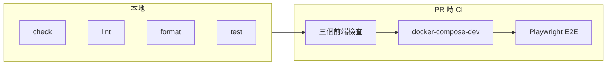

# Testing 與 CI 指南（Frontend）

本文件說明前端的**檢查流程**與 **CI（持續整合）**，給不熟這套流程的隊友用。  
三個前端（astro-landing、astro-human、astro-ai）的檢查方式一致；E2E 則在專案根目錄旁的 `e2e/` 跑。

---

## 重要：要在「對的目錄」跑指令

本專案**沒有**在 repo 根目錄放 `package.json`，所以：

- **前端的 check / lint / format / test**：都要先 `cd` 到該前端的資料夾再跑。
- **E2E**：要先啟動 docker-compose-dev，再到 `e2e/` 資料夾跑 Playwright。

若在根目錄直接跑 `npm run test` 會出現「找不到 package.json」的錯誤，這是預期行為，改到對應目錄即可。

---

## 流程總覽



- **本地**：在每個前端資料夾可跑 check / lint / format / test。
- **CI**：開 PR 時會自動跑「三個前端的檢查」→ 通過後再跑「整機 + E2E」。

---

## 一、本地檢查（單一前端）

適用情境：改完某一個前端的程式，想先確認沒壞再 push。

### 1. 進入該前端的目錄

```bash
cd frontend/astro-landing   # 或 astro-human / astro-ai
```

### 2. 安裝依賴（第一次或 package.json 有變更時）

```bash
npm install
# 若 CI 或你想跟 lock 檔完全一致，可用：npm ci（需已有 package-lock.json）
```

### 3. 依序跑四種檢查

| 指令 | 在做什麼 | 失敗時通常表示 |
|------|----------|----------------|
| `npm run check` | Astro + TypeScript 型別與專案檢查 | 型別錯誤或 Astro 設定問題 |
| `npm run lint` | ESLint 檢查程式風格與常見錯誤 | 風格不符或潛在 bug |
| `npm run format:check` | Prettier 檢查格式（不改檔） | 縮排、引號等未依設定 |
| `npm run test` | Vitest 跑單元測試 | 邏輯或介面與測試不符 |

建議順序：先 `check`，再 `lint`、`format:check`，最後 `test`。  
若希望**自動修正**（不只看報錯）：

- 格式：`npm run format`
- Lint：`npm run lint:fix`

---

## 二、E2E（Playwright）— 整機煙霧測試

E2E 會用瀏覽器實際打開「已經在跑的」站台，確認首頁與空狀態能載入。  
前提：先用 `docker-compose-dev.yaml` 把整機跑起來。

### 步驟 1：在專案根目錄啟動 dev 環境

```bash
# 在專案根目錄（Gemini-Blog/）
cp .env.example .env
# 編輯 .env：至少填入 MYSQL_*，GHOST_CONTENT_API_KEY 可用 26 碼 hex 或留空（會顯示空狀態）
docker compose -f docker-compose-dev.yaml up -d --build
```

等服務都起來（約 1～2 分鐘），可先手動開 http://localhost:3080、3081、3082、2368 確認。

### 步驟 2：跑 E2E

```bash
cd e2e
npm install          # 第一次或 e2e/package.json 有變更時；若有 package-lock.json 可用 npm ci
npx playwright install --with-deps   # 第一次需安裝瀏覽器
npx playwright test
cd ..
```

### 步驟 3：收尾（關掉 dev 環境）

```bash
docker compose -f docker-compose-dev.yaml down -v
```

E2E 會檢查：landing / human / ai / ghost 四個 URL 能回 200，且 human、ai 在無文章時會出現「尚無文章」。

---

## 三、CI（Pull Request 時自動跑）

開 **Pull Request** 時，GitHub Actions 會自動跑一套檢查，不用手動觸發。

### 會跑什麼

1. **Frontend checks（三個前端各跑一次）**
   - 在 `frontend/astro-landing`、`frontend/astro-human`、`frontend/astro-ai` 分別執行：
   - `npm ci` → `npm run check` → `npm run lint` → `npm run format:check` → `npm run test`
2. **E2E**
   - 用 CI 提供的 `.env` 跑 `docker compose -f docker-compose-dev.yaml up -d --build`
   - 在 `e2e/` 跑 `npx playwright test`
   - 結束後會執行 `docker compose ... down -v` 清理

設定檔位置： [.github/workflows/ci-frontend.yml](../.github/workflows/ci-frontend.yml)

### 怎麼看結果

- PR 頁面會顯示 **Checks**：通過時是綠色勾勾，失敗時會有紅色叉。
- 點進失敗的 job（例如 "Frontend checks (astro-human)" 或 "E2E (Playwright)"），再點該 job 裡的步驟，即可看到 log。

### 失敗時怎麼查

- **Frontend checks 失敗**：看是哪一個前端、哪一步（check / lint / format:check / test）。在本地進該前端目錄，重跑同一個指令，依 log 修正。
- **E2E 失敗**：可能是服務沒在時限內起來、或網頁內容與預期不符。本地用「二、E2E」流程重現一次；若本地通過而 CI 失敗，可能是 CI 環境或逾時，可再拉長等待或檢查 workflow 的 `.env` / 依賴。

---

## 四、名詞簡表

| 名詞 | 說明 |
|------|------|
| **check** | Astro 內建的型別與專案檢查（`astro check`） |
| **lint** | ESLint：靜態檢查程式碼風格與常見錯誤 |
| **format** | Prettier：程式碼格式（縮排、換行、引號等） |
| **unit test** | Vitest：跑 `*.test.ts` / `*.spec.ts`，測函式或模組邏輯 |
| **E2E** | Playwright：用真實瀏覽器開網址，測整機是否正常 |
| **CI** | GitHub Actions：在 PR 上自動跑上述檢查，確保合併前沒壞 |

---

## 五、快速對照：我想…

| 我想… | 作法 |
|--------|------|
| 改完一個前端，確認沒壞 | `cd frontend/astro-xxx` → `npm run check` → `npm run lint` → `npm run format:check` → `npm run test` |
| 自動修格式 | 在該前端目錄跑 `npm run format` |
| 自動修 lint 可修的部分 | 在該前端目錄跑 `npm run lint:fix` |
| 跑整機 + 瀏覽器 E2E | 根目錄 `docker compose -f docker-compose-dev.yaml up -d --build` → `cd e2e` → `npx playwright test` |
| 看 PR 有沒有通過檢查 | 看 PR 的 Checks：綠勾即通過，紅叉點進去看對應 job 的 log |

更多日常開發指令見 [development.md](development.md)，部署與 Ghost 流程見 [deployment.md](deployment.md)、[ghost-cms-guide.md](ghost-cms-guide.md)。
