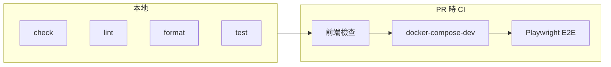

# Testing 與 CI 指南（Frontend）

本文件說明前端的**檢查流程**與 **CI（持續整合）**。

---

## 重要：要在「對的目錄」跑指令

本專案**沒有**在 repo 根目錄放 `package.json`，所以：

- **前端的 check / lint / format / test**：都要先 `cd frontend` 再跑。
- **E2E**：要先啟動 docker-compose-dev，再到 `e2e/` 資料夾跑 Playwright。

---

## 流程總覽



- **本地**：在 `frontend/` 目錄跑 check / lint / format / test。
- **CI**：開 PR 時自動跑前端檢查 → 通過後跑整機 + E2E。

---

## 一、本地檢查

適用情境：改完程式，想先確認沒壞再 push。

### 1. 進入前端目錄

```bash
cd frontend
```

### 2. 安裝依賴（第一次或 package.json 有變更時）

```bash
npm install
```

### 3. 依序跑四種檢查

| 指令 | 在做什麼 | 失敗時通常表示 |
|------|----------|----------------|
| `npm run check` | Astro + TypeScript 型別與專案檢查 | 型別錯誤或 Astro 設定問題 |
| `npm run lint` | ESLint 檢查程式風格與常見錯誤 | 風格不符或潛在 bug |
| `npm run format:check` | Prettier 檢查格式（不改檔） | 縮排、引號等未依設定 |
| `npm run test` | Vitest 跑單元測試 | 邏輯或介面與測試不符 |

若希望**自動修正**：

- 格式：`npm run format`
- Lint：`npm run lint:fix`

---

## 二、E2E（Playwright）— 整機煙霧測試

E2E 會用瀏覽器實際打開站台，確認各路徑能載入。

### 步驟 1：啟動 dev 環境

```bash
# 在專案根目錄
cp .env.example .env
# 編輯 .env
docker compose -f docker-compose-dev.yaml up -d --build
```

等服務起來後（約 1-2 分鐘），確認可存取：

| URL | 內容 |
|-----|------|
| http://localhost:3080 | Landing 門戶 |
| http://localhost:3080/novis/ | Novis 部落格 |
| http://localhost:3080/lilin/ | Lilin 部落格 |
| http://localhost:3080/cms/ | Ghost CMS |

### 步驟 2：跑 E2E

```bash
cd e2e
npm install
npx playwright install --with-deps
npx playwright test
cd ..
```

### 步驟 3：收尾

```bash
docker compose -f docker-compose-dev.yaml down -v
```

---

## 三、CI（Pull Request 時自動跑）

開 **Pull Request** 時，GitHub Actions 會自動跑檢查。

### 會跑什麼

1. **Frontend checks**
   - 在 `frontend/` 執行：`npm ci` → `npm run check` → `npm run lint` → `npm run format:check` → `npm run test`
2. **E2E**
   - 用 CI 的 `.env` 跑 `docker compose -f docker-compose-dev.yaml up -d --build`
   - 在 `e2e/` 跑 `npx playwright test`
   - 結束後清理

設定檔位置：[.github/workflows/ci-frontend.yml](../.github/workflows/ci-frontend.yml)

### 怎麼看結果

- PR 頁面會顯示 **Checks**：通過時是綠色勾勾，失敗時會有紅色叉。
- 點進失敗的 job 看 log。

---

## 四、名詞簡表

| 名詞 | 說明 |
|------|------|
| **check** | Astro 內建的型別與專案檢查（`astro check`） |
| **lint** | ESLint：靜態檢查程式碼風格與常見錯誤 |
| **format** | Prettier：程式碼格式（縮排、換行、引號等） |
| **unit test** | Vitest：跑 `*.test.ts` / `*.spec.ts`，測函式或模組邏輯 |
| **E2E** | Playwright：用真實瀏覽器開網址，測整機是否正常 |
| **CI** | GitHub Actions：在 PR 上自動跑上述檢查 |

---

## 五、快速對照：我想…

| 我想… | 作法 |
|--------|------|
| 改完前端確認沒壞 | `cd frontend` → `npm run check` → `npm run lint` → `npm run format:check` → `npm run test` |
| 自動修格式 | `cd frontend && npm run format` |
| 自動修 lint | `cd frontend && npm run lint:fix` |
| 跑整機 + E2E | 根目錄 `docker compose -f docker-compose-dev.yaml up -d --build` → `cd e2e` → `npx playwright test` |
| 看 PR 檢查結果 | PR 頁面的 Checks 區段 |

更多開發指令見 [development.md](development.md)，部署見 [deployment.md](deployment.md)。
